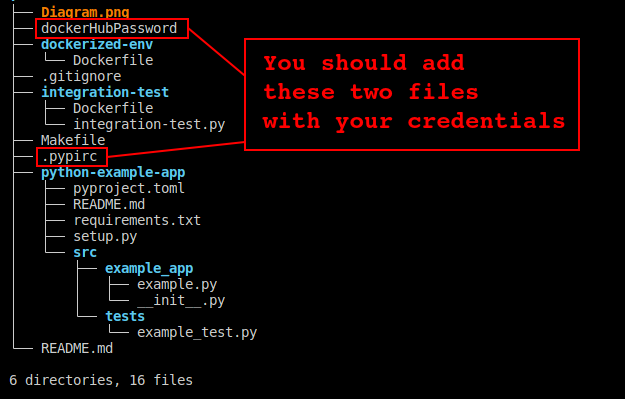

# kc-devops-6-cicd-local-pipelines-instructor-guide 

Resources :books: to guide the training ***Development Lifecycle: CI/CD*** from [KeepCoding](https://keepcoding.io/) DevOps bootcamp.

> Part 1 out of 3: Local Pipelines :round_pushpin:

## Requirements :point_down:
- A [docker hub](https://hub.docker.com/) account.
- A [PyPI](https://pypi.org/) account. 

### Prepare environment to run it with docker :whale: (Recommended)
- `docker` (Check that `docker run hello-world` works)

### Prepare environment to run it in a virtual machine or workstation :computer:
- `make` (Check that `make --version` in your terminal outputs something like `GNU Make 4.X [...]`)
- `python3.8` or higher (Check that `python3 --version` in your terminal outputs something like `Python 3.X.X`)
- `pip3` (Check that `pip3 --version` in your terminal outputs something like `pip 20.X.X from [...] (python 3.X)` which points to previous installation of `python3.8`)
- `docker` (Check that  `docker run hello-world` works)

## How to run it :gear:

1. Change the name of the user for dockerhub `kctest2` by the name of your own user in `Makefile`
1. Set just the password for your dockerhub account in a file named `dockerHubPassword` in the root of the project
1. Create a [.pypirc file with the standard format](https://packaging.python.org/en/latest/specifications/pypirc/) in the root of the project with your credentials to Pypi



### To run it with docker :whale: (Recommended)
```bash
    docker build -t dockerized-env-make -f dockerized-env/Dockerfile . && \
        docker run --rm -it -v /var/run/docker.sock:/var/run/docker.sock dockerized-env-make
```

### To run it in your virtual-machine or workstation
```bash
    make
```

## Instructor script :shipit:
1. Create python app & .gitignore
2. Create unit test and run them with the terminal
3. Create targets to build the app
4. Add unit-test and coverage targets
5. Add version, package and publish targets
6. Add docker files
7. Add dockerize, push and integration-test

## Diagram
